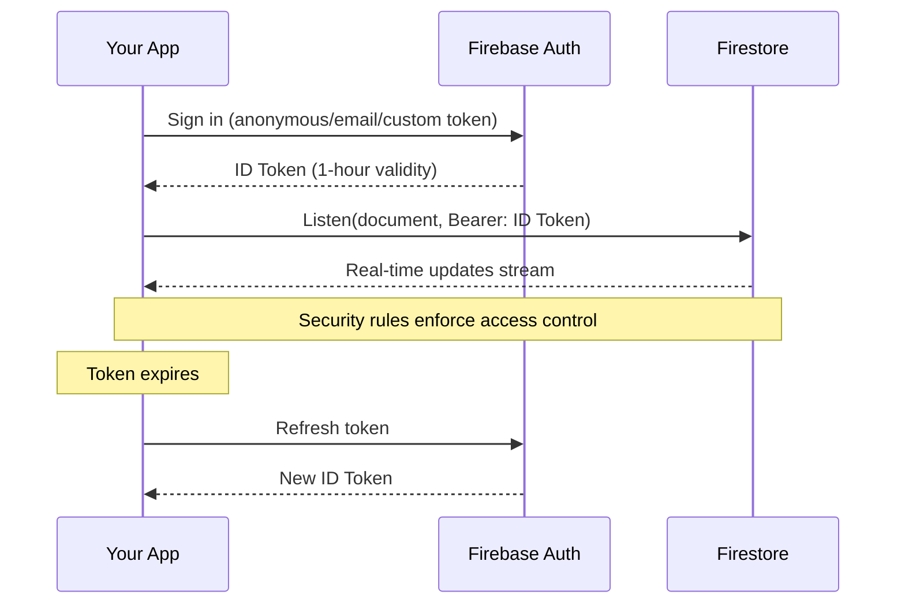

# Client-Side Firestore Authentication Without Service Accounts

This guide explains how to use Firestore realtime listeners in client applications **without embedding service account credentials**.

## Overview

Previously, `FirestoreListenClient` required service account credentials, which is dangerous in client apps because:
- Service accounts grant **admin-level access** to your entire Firebase project
- Credentials can be extracted from compiled apps
- Compromised credentials = complete project takeover

**Now you can use Firebase Authentication instead!**

## How It Works



## Authentication Methods

### 1. Anonymous Authentication

Perfect for public features where you want to track usage but don't need user identity:

```dart
final tokenProvider = await IdTokenProvider.signInAnonymously(
  apiKey: 'AIzaSy...',  // Firebase Web API Key
  projectId: 'my-project',
);

final client = FirestoreListenClient(
  projectId: 'my-project',
  tokenProvider: tokenProvider,
);

await for (final response in client.listenDocument('public/status')) {
  // Handle updates
}
```

**Use cases:**
- Public dashboards
- Live status indicators
- Guest mode features
- Analytics tracking

### 2. Email/Password Authentication

For authenticated users with accounts:

```dart
final tokenProvider = await IdTokenProvider.signInWithEmailPassword(
  apiKey: 'AIzaSy...',
  projectId: 'my-project',
  email: 'user@example.com',
  password: 'password123',
);
```

**Use cases:**
- User-specific data
- Private documents
- Authenticated features

### 3. Custom Token Authentication

For advanced scenarios where your backend generates custom tokens with specific claims:

```dart
// Server-side: Generate custom token with admin SDK
final customToken = await adminAuth.createCustomToken(userId, {
  'role': 'premium',
  'team': 'engineering',
});

// Client-side: Exchange custom token for ID token
final tokenProvider = await IdTokenProvider.signInWithCustomToken(
  apiKey: 'AIzaSy...',
  projectId: 'my-project',
  customToken: customToken,
);
```

**Use cases:**
- Backend-controlled authentication
- Custom claims/roles
- Third-party auth integration

### 4. Saved Session Restoration

For persisting authentication across app restarts:

```dart
// Save session
final idToken = tokenProvider.currentIdToken;
final refreshToken = tokenProvider.refreshTokenForSaving;
final userId = tokenProvider.userId;
final expiresAt = tokenProvider.expiresAt;
await storage.saveSession(idToken, refreshToken, userId, expiresAt);

// Restore session later
final tokenProvider = await IdTokenProvider.fromSavedTokens(
  apiKey: 'AIzaSy...',
  projectId: 'my-project',
  idToken: savedIdToken,
  refreshToken: savedRefreshToken,
  userId: savedUserId,
  expiresAt: savedExpiresAt,
);
```

**Use cases:**
- Persistent login
- Background sync
- Offline-first apps

## Security Rules

Configure Firestore security rules to control access based on authentication:

### Allow All Authenticated Users

```javascript
rules_version = '2';
service cloud.firestore {
  match /databases/{database}/documents {
    // Public read-only data
    match /public/{document=**} {
      allow read: if request.auth != null;
      allow write: if false;  // Admin only
    }

    // Public read/write for authenticated users
    match /shared/{document=**} {
      allow read, write: if request.auth != null;
    }
  }
}
```

### User-Specific Access

```javascript
rules_version = '2';
service cloud.firestore {
  match /databases/{database}/documents {
    // Users can only access their own documents
    match /users/{userId} {
      allow read, write: if request.auth != null
                          && request.auth.uid == userId;
    }

    // Users can read any profile but only write their own
    match /profiles/{userId} {
      allow read: if request.auth != null;
      allow write: if request.auth != null
                     && request.auth.uid == userId;
    }
  }
}
```

### Role-Based Access (with custom claims)

```javascript
rules_version = '2';
service cloud.firestore {
  match /databases/{database}/documents {
    // Admin-only collection
    match /admin/{document=**} {
      allow read, write: if request.auth != null
                          && request.auth.token.role == 'admin';
    }

    // Team-based access
    match /teams/{teamId}/{document=**} {
      allow read, write: if request.auth != null
                          && request.auth.token.team == teamId;
    }
  }
}
```

## Setup Instructions

### 1. Enable Authentication

1. Go to [Firebase Console](https://console.firebase.google.com)
2. Select your project
3. Navigate to **Authentication** → **Sign-in method**
4. Enable your desired methods:
   - **Anonymous** - For public/guest features
   - **Email/Password** - For user accounts
   - **Custom** - Always enabled (for custom tokens)

### 2. Get Your API Key

1. Go to **Project Settings** → **General**
2. Find **Web API Key** under "Project credentials"
3. Copy the key (starts with `AIzaSy...`)

⚠️ **Note:** The Web API Key is safe to embed in client apps - it identifies your project but doesn't grant privileged access. Security is enforced by:
- Authentication (users must sign in)
- Security rules (control what authenticated users can access)

### 3. Configure Security Rules

1. Go to **Firestore Database** → **Rules**
2. Add rules that allow authenticated access
3. Test your rules with the Rules Playground

Example starting rules:

```javascript
rules_version = '2';
service cloud.firestore {
  match /databases/{database}/documents {
    // Block all by default
    match /{document=**} {
      allow read, write: if false;
    }

    // Allow authenticated read/write to specific paths
    match /public/{document=**} {
      allow read: if request.auth != null;
    }
  }
}
```

### 4. Use in Your App

```dart
import 'package:firebase_realtime_toolkit/firebase_realtime_toolkit.dart';

// Sign in
final tokenProvider = await IdTokenProvider.signInAnonymously(
  apiKey: 'YOUR_WEB_API_KEY',
  projectId: 'your-project-id',
);

// Connect to Firestore
final client = FirestoreListenClient(
  projectId: 'your-project-id',
  tokenProvider: tokenProvider,
);

// Listen to documents
await for (final response in client.listenDocument('public/status')) {
  if (response.hasDocumentChange()) {
    print('Update: ${response.documentChange.document.fields}');
  }
}

// Cleanup
await client.close();
tokenProvider.close();
```

## Token Management

### Automatic Refresh

`IdTokenProvider` automatically refreshes expired tokens:

```dart
final provider = await IdTokenProvider.signInAnonymously(
  apiKey: apiKey,
  projectId: projectId,
);

// Tokens are automatically refreshed when needed
// Default refresh buffer: 5 minutes before expiry
await provider.getAccessToken();  // Returns fresh token

// Customize refresh buffer
provider.refreshBuffer = Duration(minutes: 10);
```

### Manual Refresh

Force a token refresh:

```dart
await tokenProvider.forceRefresh();
```

### Check Expiration

```dart
if (tokenProvider.isTokenExpired) {
  print('Token will expire soon');
  await tokenProvider.forceRefresh();
}
```

## Testing

### Auth Functionality Test

Tests authentication without requiring Firestore access:

```bash
dart run test/auth_test.dart --api-key YOUR_API_KEY
```

Verifies:
- ✅ Anonymous sign-in
- ✅ Token refresh
- ✅ User data retrieval
- ✅ IdTokenProvider integration
- ✅ Session save/restore
- ✅ Token expiration logic

### Read-Only Listener Test

Tests Firestore listener (requires security rules allowing read):

```bash
dart run test/integration_test_readonly.dart \
  --api-key YOUR_API_KEY \
  --project your-project-id \
  --document path/to/doc \
  --timeout 60
```

### Full Integration Test

Tests both read and write (requires security rules allowing both):

```bash
dart run test/integration_test.dart \
  --api-key YOUR_API_KEY \
  --project your-project-id \
  --document test/integration
```

## Examples

### Example 1: Live Status Dashboard

```dart
final tokenProvider = await IdTokenProvider.signInAnonymously(
  apiKey: apiKey,
  projectId: projectId,
);

final client = FirestoreListenClient(
  projectId: projectId,
  tokenProvider: tokenProvider,
);

print('📊 Watching system status...');
await for (final response in client.listenDocument('status/system')) {
  if (response.hasDocumentChange()) {
    final fields = response.documentChange.document.fields;
    final status = fields['status']?.stringValue ?? 'unknown';
    final color = status == 'healthy' ? '🟢' : '🔴';
    print('$color System is $status');
  }
}
```

### Example 2: User Presence

```dart
final tokenProvider = await IdTokenProvider.signInWithEmailPassword(
  apiKey: apiKey,
  projectId: projectId,
  email: userEmail,
  password: userPassword,
);

final client = FirestoreListenClient(
  projectId: projectId,
  tokenProvider: tokenProvider,
);

// Listen to friend's online status
await for (final response in client.listenDocument('presence/$friendId')) {
  if (response.hasDocumentChange()) {
    final fields = response.documentChange.document.fields;
    final isOnline = fields['online']?.booleanValue ?? false;
    print('Friend is ${isOnline ? "online" : "offline"}');
  }
}
```

### Example 3: Multi-Document Listener

```dart
final tokenProvider = await IdTokenProvider.signInAnonymously(
  apiKey: apiKey,
  projectId: projectId,
);

final client = FirestoreListenClient(
  projectId: projectId,
  tokenProvider: tokenProvider,
);

// Listen to multiple documents concurrently
await Future.wait([
  client.listenDocument('public/status').forEach((response) {
    print('[Status] ${response.documentChange.document.fields}');
  }),
  client.listenDocument('public/metrics').forEach((response) {
    print('[Metrics] ${response.documentChange.document.fields}');
  }),
  client.listenDocument('public/alerts').forEach((response) {
    print('[Alerts] ${response.documentChange.document.fields}');
  }),
]);
```

## CLI Tools

### firestore_listen_anonymous

Listen to documents without service accounts:

```bash
dart run firebase_realtime_toolkit:firestore_listen_anonymous \
  --api-key YOUR_WEB_API_KEY \
  --project your-project-id \
  --document public/status
```

Features:
- Anonymous authentication
- Real-time update display
- Detailed error messages
- Security rule guidance

## Troubleshooting

### Error: ADMIN_ONLY_OPERATION

**Problem:** Anonymous authentication is disabled

**Solution:**
1. Go to Firebase Console → Authentication → Sign-in method
2. Enable "Anonymous" provider

### Error: Missing or insufficient permissions

**Problem:** Security rules don't allow access

**Solution:**
1. Go to Firebase Console → Firestore Database → Rules
2. Add rule allowing authenticated access:
   ```javascript
   match /your/path {
     allow read: if request.auth != null;
   }
   ```

### Error: Token expired

**Problem:** Token expired and automatic refresh failed

**Solution:**
- Check internet connectivity
- Verify API key is correct
- Try manual refresh: `await tokenProvider.forceRefresh()`

### Listener receives ADD then REMOVE

**Problem:** Security rules blocking access

**Solution:**
- Check that security rules allow `request.auth != null`
- Verify the document path matches your rules
- Test rules in Firebase Console Rules Playground

## Comparison: Service Account vs ID Token

| Feature | Service Account | ID Token (Client Auth) |
|---------|----------------|------------------------|
| **Security** | ❌ Admin access (dangerous in clients) | ✅ User-scoped access |
| **Deployment** | ❌ Cannot embed in client apps | ✅ Safe for client apps |
| **Access Control** | ❌ Bypasses security rules | ✅ Enforced by security rules |
| **Use Case** | ✅ Server-side only | ✅ Client & server |
| **Setup** | ❌ Complex (service account file) | ✅ Simple (API key) |
| **Cost** | Same | Same |
| **Performance** | Same | Same |

## Best Practices

### 1. Use Anonymous Auth for Public Features

```dart
// ✅ Good: Public dashboards with anonymous auth
final provider = await IdTokenProvider.signInAnonymously(
  apiKey: apiKey,
  projectId: projectId,
);
```

### 2. Scope Security Rules Tightly

```javascript
// ✅ Good: Minimal access
match /public/{document=**} {
  allow read: if request.auth != null;
  allow write: if false;  // No writes
}

// ❌ Bad: Too permissive
match /{document=**} {
  allow read, write: if request.auth != null;
}
```

### 3. Save Refresh Tokens Securely

```dart
// ✅ Good: Encrypted storage
await secureStorage.write(
  key: 'refresh_token',
  value: tokenProvider.refreshTokenForSaving,
);

// ❌ Bad: Plaintext storage
await prefs.setString('refresh_token', token);
```

### 4. Handle Token Expiration Gracefully

```dart
// ✅ Good: Graceful error handling
try {
  await for (final response in client.listenDocument(path)) {
    // Handle updates
  }
} on Exception catch (e) {
  if (e.toString().contains('UNAUTHENTICATED')) {
    await tokenProvider.forceRefresh();
    // Retry connection
  }
}
```

### 5. Clean Up Resources

```dart
// ✅ Good: Always cleanup
try {
  await for (final response in client.listenDocument(path)) {
    // Handle updates
  }
} finally {
  await client.close();
  tokenProvider.close();
}
```

## FAQ

### Q: Is the Web API Key safe to embed?

**A:** Yes! The Web API Key identifies your project but doesn't grant privileged access. Security is enforced by:
- Authentication (users must sign in)
- Security rules (control what users can access)

### Q: How long do tokens last?

**A:** ID tokens expire after **1 hour**. `IdTokenProvider` automatically refreshes them using the refresh token (which doesn't expire).

### Q: Can I use this on Flutter Web?

**A:** No, Firestore gRPC doesn't work in browsers. Use the official Firebase SDK for web. This package is perfect for:
- Flutter mobile (iOS/Android)
- Flutter desktop (macOS/Windows/Linux)
- Dart CLI/backend applications

### Q: What about offline support?

**A:** This package focuses on real-time listening. For offline support, use the official Firebase SDK which includes local caching.

### Q: Can I listen to collections?

**A:** Currently, only document listening is supported. Collection queries require more complex implementation. This may be added in future versions.

### Q: How do I test without a real Firebase project?

**A:** Use the Firebase Emulator Suite:
```bash
firebase emulators:start --only auth,firestore
```

Then connect with:
```dart
final tokenProvider = await IdTokenProvider.signInAnonymously(
  apiKey: 'fake-api-key',  // Emulator doesn't validate
  projectId: 'demo-project',
);
```

## Additional Resources

- [Firebase Auth REST API Reference](https://firebase.google.com/docs/reference/rest/auth)
- [Firestore Security Rules Guide](https://firebase.google.com/docs/firestore/security/get-started)
- [Firebase Web API Key vs Service Account](https://firebase.google.com/docs/projects/api-keys)
- [Project README](../README.md)
- [Architecture Guide](ARCHITECTURE.md)

## Contributing

Found a bug or want to contribute? Check out our [Contributing Guidelines](../CONTRIBUTING.md).

## License

MIT License - see [LICENSE](../LICENSE) for details.
